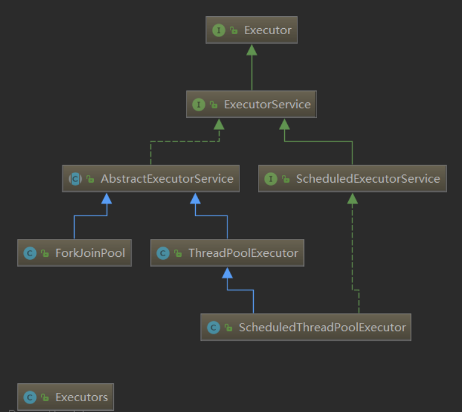
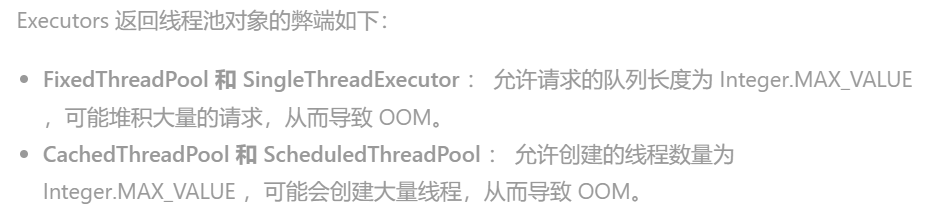

### 一、Executor框架和线程池

**1.相关的体系结构**



**（1）Executor**

**执行器， 可执行任意一个`Runnable`任务。**

```java
public interface Executor {
    void execute(Runnable command);
}
```

该接口提供了一个将任务提交与任务执行（包括线程使用、调度）分离的方法。因为对于任务本身来说，只需要提交给执行器即可，而不需要关心线程的创建、调度等细节。

也就是说，你尽管把任务交给我，我有可能直接执行，也有可能交给线程池执行，总之我帮你执行就行了。

> **注意：该执行器并没有规定一定异步执行任务，也有可能同步执行。**


**（2）ExecutorService**

`Executor`过于抽象，仅代表着任务的执行，因此并没有实现类直接实现该接口，平时使用得最多还是其子接口`ExecutorService`：它可以提供更多的服务。

```java
public interface ExecutorService extends Executor {

    void shutdown();

    List<Runnable> shutdownNow();

    boolean isShutdown();

    boolean isTerminated();

    boolean awaitTermination(long timeout, TimeUnit unit)
        throws InterruptedException;

    <T> Future<T> submit(Callable<T> task);

    <T> Future<T> submit(Runnable task, T result);

    Future<?> submit(Runnable task);

    <T> List<Future<T>> invokeAll(Collection<? extends Callable<T>> tasks)
        throws InterruptedException;

    <T> List<Future<T>> invokeAll(Collection<? extends Callable<T>> tasks,
                                  long timeout, TimeUnit unit)
        throws InterruptedException;

    <T> T invokeAny(Collection<? extends Callable<T>> tasks)
        throws InterruptedException, ExecutionException;

    <T> T invokeAny(Collection<? extends Callable<T>> tasks,
                    long timeout, TimeUnit unit)
        throws InterruptedException, ExecutionException, TimeoutException;
}
```

其实提交的`Runnable`任务最终都会通过`Executors.callable(runnable, result)`适配为一个`Callable<V>`去执行的。

从类图中可以看出，`ExecutorService`的实现分为两个分支：左边的`AbstractExecutorService`（一般为基于线程池的实现），以及右边的`ScheduledExecutorService`延迟/周期执行服务。


**（3）ThreadPoolExecutor**

**这是最常用也是最重要的一个实现类，它是一个带线程池的执行器，它会把`Runnable`任务扔进线程池里面进行执行，效率最高。**

> **注意：`ThreadPoolTaskExecutor`它是Spirng提供的，基于`ThreadPoolExecutor`进行包装实现。**


**（4）ForkJoinPool**


**（5）ScheduledExecutorService**

它在`ExecutorService`接口上再扩展，额外增加了**定时、周期执行**的能力。

```java
public interface ScheduledExecutorService extends ExecutorService {
	
	// ========这个两个方法提交的任务只会执行一次========
	// 创建并执行启用的一次性操作在给定的延迟之后。
    public ScheduledFuture<?> schedule(Runnable command, long delay, TimeUnit unit);
    // 创建并执行启用的一次性操作在给定的延迟之后。
    public <V> ScheduledFuture<V> schedule(Callable<V> callable, long delay, TimeUnit unit);


	// ========这个两个方法提交的任务会周期性的执行多次========
	// 在给定的初始延迟之后，以给定的时间间隔执行周期性动作。
	// 即在 initialDelay 初始延迟后initialDelay + period 执行第一次
	// initialDelay + 2 * period  执行第二次，依次类推
	// 特点：下一次任务的执行并不管你上次任务是否执行完毕
	// 所以它名叫FixedRate：固定的频率执行（每次都是独立事件）
    public ScheduledFuture<?> scheduleAtFixedRate(Runnable command,
                                                  long initialDelay,
                                                  long period,
                                                  TimeUnit unit);
	// 给定的初始延迟之后首先启用的定期动作
	// 随后【上一个执行的终止】和【下一个执行的开始之间】给定的延迟。
	// 也就是说delay表示的是上一次的end和下一次start之间的时间，两次之间是有关系的，不同于上个方法
	// 所以它名叫FixedDelay：两次执行间固定的延迟
    public ScheduledFuture<?> scheduleWithFixedDelay(Runnable command,
                                                     long initialDelay,
                                                     long delay,
                                                     TimeUnit unit);

}

```

注意两点：

- 定时执行并不同于周期执行；
- 该接口和线程池无关，线程池靠其唯一实现类`ScheduledThreadPoolExecutor`来实现；


**（6）ScheduledThreadPoolExecutor**

`ScheduledExecutorService`的唯一实现类，**可以在线程池里执行任务，并且还可以定时、周期性的执行**。


**（7）Executors**

创建`Executor`执行器的**工具类**（均为静态方法），其功能包括：

- 快速创建带有线程池的执行器`ThreadPoolExecutor`（ExecutorService）
- 快速创建具有线程池，且定时、周期执行任务能力的`ScheduledThreadPoolExecutor`（ScheduledExecutorService）

下面分别介绍一下可以使用`Executors`创建的四种带线程池的执行器：

- **newFixedThreadPool**：**建立一个线程数量固定的线程池**，规定的最大线程数量，超过这个数量之后进来的任务，会放到等待队列中，如果有空闲线程，则在等待队列中获取，遵循先进先出原则。**corePoolSize 和 maximumPoolSize 要一致**，Executors 默认使用的是` LinkedBlockingQueue` 作为等待队列，这是一个**无界队列**。
- **newSingleThreadExecutor**：建立一个**只有一个线程的线程池**，如果有超过一个任务进来，只有一个可以执行，其余的都会放到等待队列中，如果有空闲线程，则在等待队列中获取，遵循先进先出原则。使用 `LinkedBlockingQueue` 作为等待队列，可能出现等待队列无限长的问题。
- **newCachedThreadPool**：**缓存型线程池**，在核心线程达到最大值之前，有任务进来就会创建新的核心线程，并加入核心线程池，即时有空闲的线程，也不会复用。达到最大核心线程数后，新任务进来，如果有空闲线程，则直接拿来使用，如果没有空闲线程，则新建临时线程。并且线程的允许空闲时间都很短，如果超过空闲时间没有活动，则销毁临时线程。**关键点就在于它使用`SynchronousQueue`作为等待队列，它不会保留任务，新任务进来后，直接创建临时线程处理**。
- **newScheduledThreadPool**：计划型线程池，可以设置固定时间的延时或者定期执行任务，同样是看线程池中有没有空闲线程，如果有，直接拿来使用，如果没有，则新建线程加入池。使用的是` DelayedWorkQueue `作为等待队列，这中类型的队列会保证只有到了指定的延时时间，才会执行任务。

最重要的一点，对于`Executors`**一般用于我们自己测试，不能用于生产环境！**

