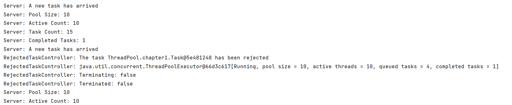

**1.首先我们需要一个ThreadPoolExecutor类型的实例对象**

可以通过`Executors`工具类来创建，也可以通过`ThreadPoolExecutor`类来创建，书上用的是`Executors`，这里我采用的是后者。

```java
//通过一个Server类来执行任务
public class Server {

    private final ThreadPoolExecutor executor;

    public Server(){
        executor = new ThreadPoolExecutor(
                5,//  int corePoolSize  核心线程数量为5
                10,//  int maximumPoolSize  最大线程数量为10
                3,// long keepAliveTime  超时3秒未调用就会释放关闭
                TimeUnit.SECONDS,//  TimeUnit unit  超时单位
                new LinkedBlockingDeque<>(4),//  任务等待队列
                new RejectedTaskController()//  传入自定义的拒绝策略
        );
    }
}
```

**2.实现拒绝策略**

我们实现自己的拒绝策略，需要实现`RejectedExecutionHandler`接口，这里我们就简单的进行打印。

```java
public class RejectedTaskController implements RejectedExecutionHandler {
    @Override
    public void rejectedExecution(Runnable r, ThreadPoolExecutor executor) {
        System.out.printf("RejectedTaskController: The task %s has been rejected\n",r.toString());
        System.out.printf("RejectedTaskController: %s\n",executor.toString());
        System.out.printf("RejectedTaskController: Terminating: %s\n",executor.isTerminating());
        System.out.printf("RejectedTaskController: Terminated: %s\n",executor.isTerminated());
    }
}
```

**3.部分运行结果**

我们的线程池大小为最大十个线程，任务队列为4，所以当任务数量大于14时会执行拒绝策略，如图所示。

