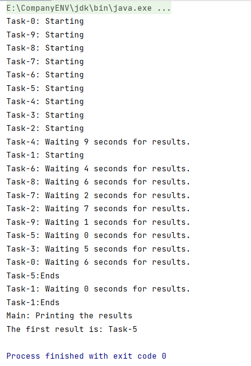
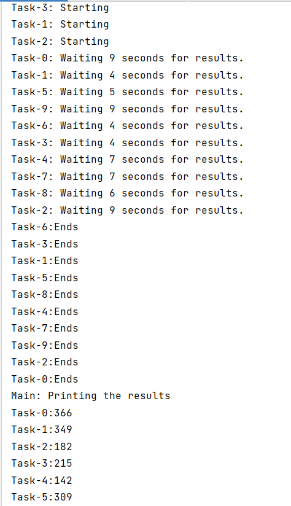

### 一、运行多个任务并处理第一个返回结果

当我们运行多个并发任务来解决一个问题时，有时我们只关心第一个返回结果。例如我们想排序一个数组，可以运行多个任务，用手上全部的排序算法对数组进行排序，然后得到执行速度最快的算法返回的数组。

- 我们可以通过`ExecutorService`接口中的`invokeAny（）`方法来得到第一个返回结果；

```java
public interface ExecutorService extends Executor {
    //该方法执行全部任务并返回第一个任务执行结果
    <T> T invokeAny(Collection<? extends Callable<T>> tasks)
        throws InterruptedException, ExecutionException;

    //该方法执行全部任务并返回第一个正常运行结束且未抛出异常和未超过设定时间的任务执行结果
    <T> T invokeAny(Collection<? extends Callable<T>> tasks,
                    long timeout, TimeUnit unit)
        throws InterruptedException, ExecutionException, TimeoutException;
}

```

**1.创建一个`Result`类用来存储返回结果**

```java
public class Result {
    private String name;
    private int value;
}
```

**2.创建一个`Task`类表示执行任务，并实现泛型为Result的Callable接口**

```java
public class Task implements Callable<Result> {

    private final String name;

    public Task(String name){
        this.name=name;
    }

    @Override
    public Result call() throws Exception {
        //打印启动相关信息
        System.out.printf("%s: Starting\n",this.name);
        long duration=(long) (Math.random()*10);
        System.out.printf("%s: Waiting %d seconds for results.\n",this.name,duration);
        //等待一段随机时间
        TimeUnit.SECONDS.sleep(duration);
        //计算5个随机数字之和,生成一个int值，并在Result中返回
        int value=0;
        for (int i=0; i<5; i++){
            value+=(int) (Math.random()*100);
        }
        Result result = new Result();
        result.setName(this.name);
        result.setValue(value);
        //任务结束相关信息
        System.out.println(this.name+":Ends");
        return result;
    }
}
```

**3.主函数及`Main`类的实现**

```java
public class Main {
    public static void main(String[] args) {
        ExecutorService executor = Executors.newCachedThreadPool();
        List<Task> taskList = new ArrayList<>();
        //创建十个任务对象加入taskList
        for (int i = 0; i < 10; i++) {
            Task task = new Task("Task-" + i);
            taskList.add(task);
        }
        List<Future<Result>> resultList=null;
        //通过firstResult变量接收第一个返回的结果
        Result firstResult=new Result();
        try {
            firstResult=executor.invokeAny(taskList);
        } catch (InterruptedException | ExecutionException e) {
            e.printStackTrace();
        }
        executor.shutdown();
        System.out.println("Main: Printing the results");
        System.out.println("The first result is: "+firstResult.getName());
    }
}

```

**4.运行结果**

只有`Task-1`和`Task-5`执行完成了，并返回了`Task-5`



### 二、运行多个任务并处理全部返回结果

ExecutorService接口中有个名为awaitTermination（）的方法，它包括以下的功能：

- 阻塞当前线程（线程池的主线程）

- 等所有已提交的任务（包括正在跑的和队列中等待的）执行完；
- 或者 等超时时间到了（timeout 和 TimeUnit设定的时间）；
- 或者 线程被中断，抛出InterruptedException
- 监测 ExecutorService 是否已经关闭，返回true（shutdown请求后所有任务执行完毕）或false（已超时）

当我们要处理全部任务的返回结果时，往往使用`invokeAll()`方法。

```java
public interface ExecutorService extends Executor {
    //该方法执行全部任务并返回全部任务执行结果
    <T> List<Future<T>> invokeAll(Collection<? extends Callable<T>> tasks)
        throws InterruptedException;

    //返回全部结果并加了异常和超时限制
    <T> List<Future<T>> invokeAll(Collection<? extends Callable<T>> tasks,
                                  long timeout, TimeUnit unit)
        throws InterruptedException;
}
```

awaitTermination（）和invokeAll（）的区别在于，前者必须阻塞主线程，负责会立即返回，而后者不必。

测试时大体和invokeAny（）相同，只需在`Main`类稍作改动即可。

**1.主函数及`Main`类的实现**

```java
public class Main {
    public static void main(String[] args) {
        ExecutorService executor = Executors.newCachedThreadPool();
        List<Task> taskList = new ArrayList<>();
        for (int i = 0; i < 10; i++) {
            Task task = new Task("Task-" + i);
            taskList.add(task);
        }
        List<Future<Result>> resultList=null;
        Result firstResult=new Result();
        try {
            //使用一个resultList来接收返回的所有任务
            resultList=executor.invokeAll(taskList);
        } catch (InterruptedException e) {
            e.printStackTrace();
        }
        executor.shutdown();
        System.out.println("Main: Printing the results");
        for (int i = 0; i < resultList.size(); i++) {
            Future<Result> future=resultList.get(i);
            Result result= null;
            try {
                result = future.get();
                //打印出每一个返回的结果
                System.out.println(result.getName()+":"+result.getValue());
            } catch (InterruptedException|ExecutionException e) {
                e.printStackTrace();
            }
        }
    }
}
```

**2.运行结果**

