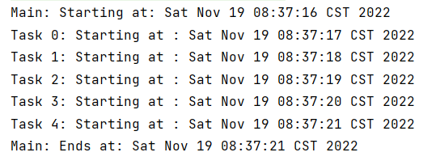

当我们向执行器提交一个任务时，可能不需要立即执行任务，而是过一段时间再执行，这时候就需要用到`ScheduledExecutorrService`接口和`ScheduledThreadPoolExecutor`类。

**1.创建一个任务类`Task`，实现Callable接口**

实现call（）方法，并在控制台打印日志记录的实际时间然后返回其他文本。

```java
public class Task implements Callable<String> {

    private final String name;

    public Task(String name){
        this.name=name;
    }

    @Override
    public String call() throws Exception {
        System.out.printf("%s: Starting at : %s\n",name,new Date());
        return "hello,world";
    }
}

```

**2.实现主方法及其所在的主类**

创建一个SchedyledThreadPoolExecutor类型的执行器，并通过其实例对象的schedule（）方法初始化并启动5个任务。

```java
public class Main {
    public static void main(String[] args) {
        ScheduledExecutorService executor = Executors.newScheduledThreadPool(1);
        System.out.printf("Main: Starting at: %s\n",new Date());
        //初始化并启动5个任务
        for (int i = 0; i < 5; i++) {
            Task task = new Task("Task "+i);
            executor.schedule(task,i+1, TimeUnit.SECONDS);
        }
        executor.shutdown();
        try {
            //等待全部任务结束
            executor.awaitTermination(1,TimeUnit.DAYS);
        } catch (InterruptedException e) {
            e.printStackTrace();
        }
        //打印结束信息
        System.out.printf("Main: Ends at: %s\n",new Date());
    }
}
```

**3.执行结果**

如果我们直接使用submit（）的话，执行结果是这样的：


schedule（）方法中包含了三个参数：

- 想要执行的任务
- 在任务执行前需要等待的时间间隔
- 时间间隔的单位，一个TimeUnit类型的常量

使用schedule（）方法执行结果如下：



