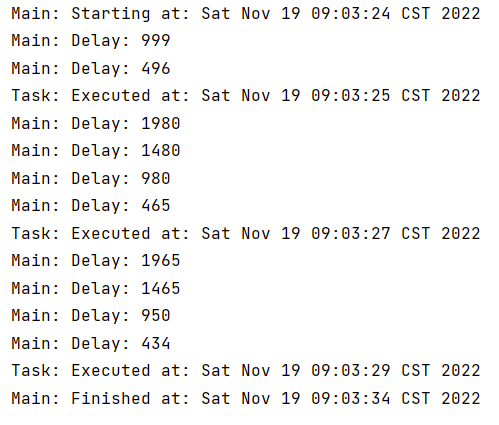

当我们普通的执行一个任务时，任务执行结束后它就会从执行器中删除，如果想再次执行这个任务，则需要再次提交它。但是通过`ScheduledThreadPoolExecutor`类，执行器可以执行周期性任务。

**1.创建任务类`Task`，实现Runnable接口**

```java
public class Task implements Runnable{

    private final String name;

    public Task(String name){
        this.name=name;
    }

    @Override
    public void run() {
        //输出当前时间来确认任务是否按照给定周期进行调度
        System.out.printf("%s: Executed at: %s\n",name,new Date());
    }
}

```

**2.实现主方法及其所在Main类**

用 scheduledAtFixRate（）方法提交一个对象给执行器，通过返回的对象获取任务的执行状态。该方法中包含四个参数，分别是：

- 要执行的任务
- 初次延迟执行任务时延迟的时间（传入1表示1000ms后执行）
- 两次任务执行之间的间隔
- 时间的单位

```java
public class Main {
    public static void main(String[] args) {
        ScheduledExecutorService executor = Executors.newScheduledThreadPool(1);
        Task task = new Task("Task");
        //提交一个任务给执行器，并可以从返回的对象中获取任务的执行状态
        ScheduledFuture<?> result = executor.scheduleAtFixedRate(task, 1, 2, TimeUnit.SECONDS);
        for (int i = 0; i < 10; i++) {
            //打印至下次任务的剩余时间，通过getDelay()方法获取下次任务的时间
            System.out.printf("Main: Delay: %d\n", result.getDelay(TimeUnit.MILLISECONDS));
            TimeUnit.MILLISECONDS.sleep(500);
        }
        executor.shutdown();
        TimeUnit.SECONDS.sleep(5);
    }
}

```

**3.执行结果**

可以看到任务每2s调度一次，每500ms在控制台输出一次。

