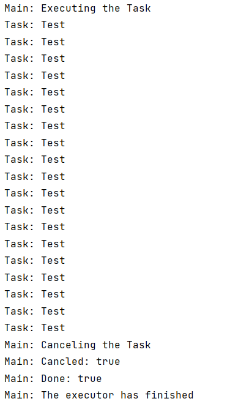

当我们需要取消一个已经提交给执行器的任务时，可以通过Future类的cancel（）方法来执行取消操作。

**1.创建一个任务类`Task`**

```java
public class Task implements Callable<String> {
    @Override
    public String call() throws Exception {
        while (true){
            System.out.printf("Task: Test\n");
            Thread.sleep(100);
        }
    }
}
```

**2.实现主方法及其所在的`Main`类**

通过submit（）方法返回一个Future对象，在该对象中调用cancel（）方法取消执行当前的任务，该方法需要传入true为参数。

```java
public class Main {
    public static void main(String[] args) {
        ExecutorService executor = Executors.newCachedThreadPool();
        Task task = new Task();
        System.out.printf("Main: Executing the Task\n");
        Future<String> result = executor.submit(task);
        try {
            TimeUnit.SECONDS.sleep(2);
        } catch (InterruptedException e) {
            e.printStackTrace();
        }
        System.out.printf("Main: Canceling the Task\n");
        result.cancel(true);

        System.out.printf("Main: Cancled: %s\n",result.isCancelled());
        System.out.printf("Main: Done: %s\n",result.isDone());
        executor.shutdown();
        System.out.printf("Main: The executor has finished");
    }
}
```

**3.执行结果如下**

